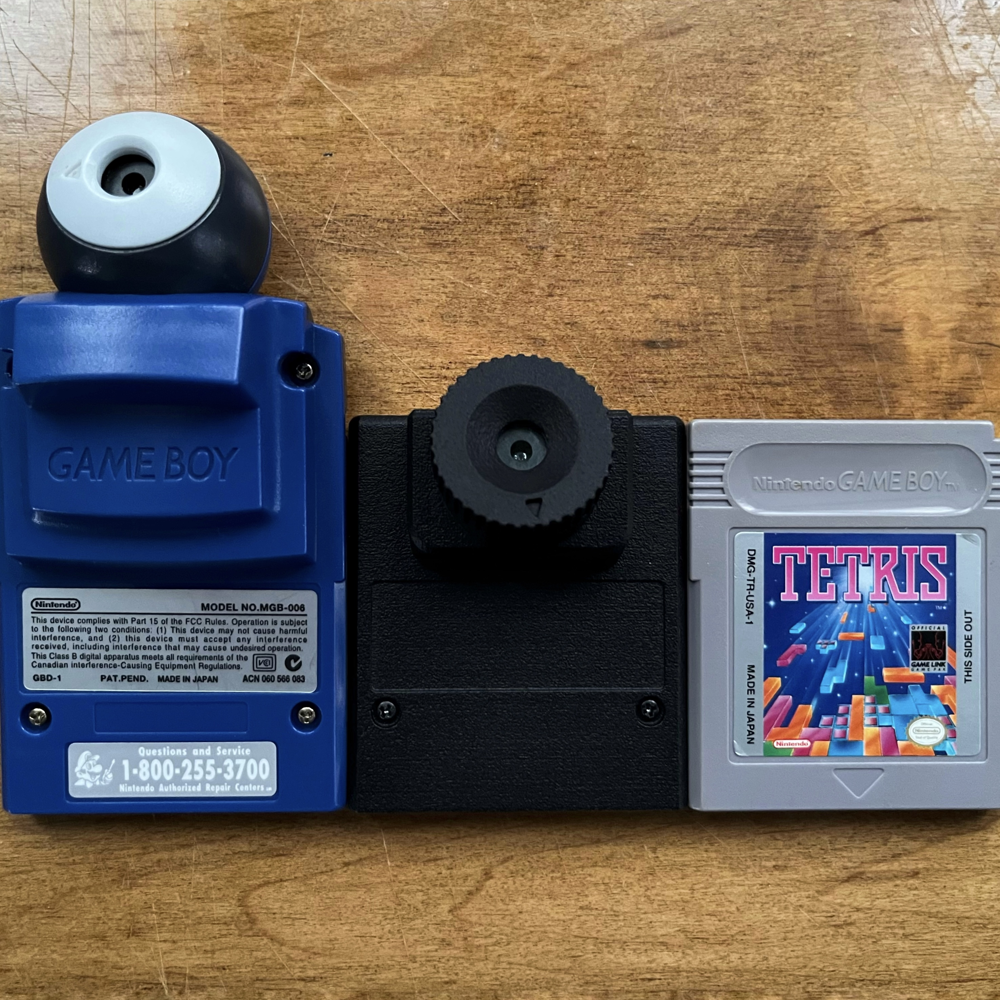
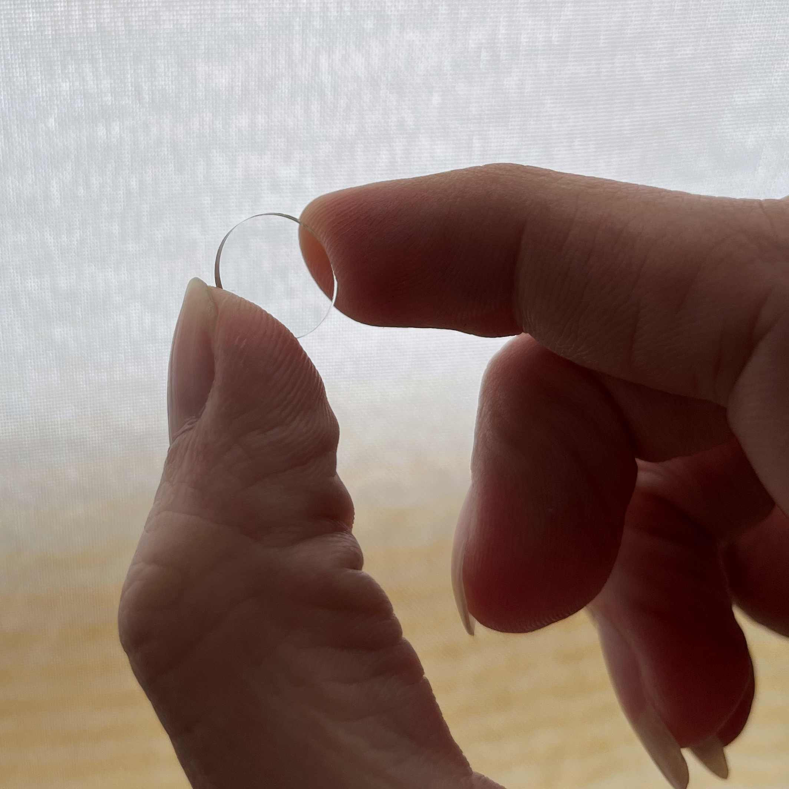
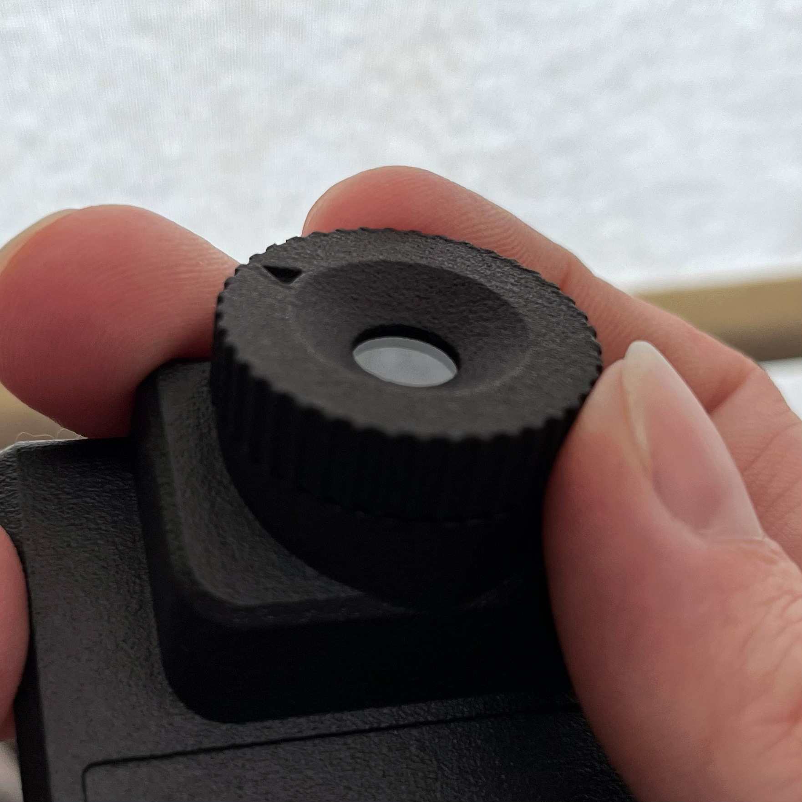

# Game Boy Mini Camera
Make your own Game Boy Camera cart resized to a typical cart (with optional macro capability)

**Mini Camera:** 
 

**Mini Macro Camera:** 
 
 Macro in action: 

## Features
* Smaller design for more portable carry
* Based on [HDR's camera flash cart](https://github.com/HDR/Gameboy-Camera-Flashcart)
  * Flashable camera cart, capable of holding 2 camera ROMs
  * FRAM storage - no battery needed for saves
* 2 custom shell options:
  * Mini shell with Game Boy cart aesthetics & streamline Pocket & Color fit
  * Macro shell with the ability to adjust the original lens for macro photography
  * More designs to come?
  
## Disclaimer
**This is a difficult mod and requires advanced soldering skills!** Do NOT attempt as your first soldering project. I am not responsible for any harm done to you, your property, or family. Because of the complication required for this mod, personal support will be limited. Order any parts at your own risk! Please review the license before attempting.

  
## Materials Needed
**Standard Mini Camera:**
* Game Boy Camera
* [Flashable mini cam PCB](https://www.pcbway.com/project/shareproject/Game_Boy_Mini_Camera_flash_cart_b1035426.html) and components (follow [HDR's components BOM](https://github.com/gameboycamera/game-boy-mini-camera/edit/main/README.md#hdrs-components-bom))
* 3D printed mini cam shell (3 parts: front, back, switch)

**Macro Mini Camera:**
* Game Boy Camera
* [Flashable mini cam PCB](https://www.pcbway.com/project/shareproject/Game_Boy_Mini_Camera_flash_cart_b1035426.html) and components (follow [HDR's components BOM](https://github.com/gameboycamera/game-boy-mini-camera/edit/main/README.md#hdrs-components-bom))
* 3D printed macro cam shell (5 parts: front, back, switch, grip, focus)
* 2x [M1 4mm countersunk screws](https://www.aliexpress.com/item/3256803019262480.html)
* Glass lens (3 options below)
  * [13mm x 1mm glass lens](https://www.aliexpress.com/item/3256802020476111.html)
  * [13mm x 1mm sapphire crystal lens](https://www.aliexpress.com/item/3256802895894374.html) (UNTESTED but should work)
  * [9.5mm x 1mm IR cut filter](https://www.aliexpress.com/item/2251832837033934.html) **AND** [M10x13x1 plastic gasket](https://www.aliexpress.com/item/3256804038243879.html) (UNTESTED but should work)

## HDR's components BOM
Lifted from [HDR's GitHub page](https://github.com/HDR/Gameboy-Camera-Flashcart)
| Reference | Part Number | Description |
|-|-|-|
| C1 | [4x4.5mm 22uF](https://www.aliexpress.com/item/32377971645.html) | 22uF 16V 4x4.5 Electrolytic Capacitor |
| C2, C3, C4, C12, C13 | [TCC0603X7R104J500CT](https://www.lcsc.com/product-detail/Multilayer-Ceramic-Capacitors-MLCC-SMD-SMT_CCTC-TCC0603X7R104J500CT_C282518.html) | 100nF 0603 Capacitor |
| C5, C6, C7, C8, C9, C10, C11 | [CC0402KRX7R7BB104](https://lcsc.com/product-detail/Multilayer-Ceramic-Capacitors-MLCC-SMD-SMT_YAGEO-CC0402KRX7R7BB104_C60474.html) | 100nF 0402 Capacitor |
| C14, C15 | [CC0603JRNPO9BN220](https://www.lcsc.com/product-detail/Multilayer-Ceramic-Capacitors-MLCC-SMD-SMT_YAGEO-CC0603JRNPO9BN220_C105620.html) | 22pF 0603 Capacitor |
| R1 | [RC0603JR-071KL](https://www.lcsc.com/product-detail/Chip-Resistor-Surface-Mount_YAGEO-RC0603JR-071KL_C14676.html) | 1K Ω 0603 Resistor |
| D1 | Diode | Harvest D2 from original cartridge |
| J1 | [B9B-ZR-SM4-TF](https://www.aliexpress.com/item/32920487056.html) | Camera Connector, Harvest or buy (JST ZH1.5MM 9 Pin) |
| SW1 | [K3-1296S-E1](https://www.lcsc.com/product-detail/Slide-Switches_Korean-Hroparts-Elec-K3-1296S-E1_C128955.html)| SPDT Switch (For 2x1MB Rom Switching) |
| U1 | MAC-GBD | Harvest U1 from original cartridge |
| U2 | [AM29F016](https://www.aliexpress.com/item/33043533022.html) | 2MB Flash |
| U3 | [FM28V100](https://www.aliexpress.com/item/4001322883101.html) | 1MB FRAM |
| U4 | [TPRT9013-33G](https://www.lcsc.com/product-detail/Linear-Voltage-Regulators-LDO_TECH-PUBLIC-TPRT9013-33GB_C587158.html) | 3.3V Voltage Regulator |

## Additional Images
      

## Ordering Instructions
### PCB:

(Uploaded to PCBWay w/ HDR's permission)
* Create your account using [THIS LINK](https://pcbway.com/g/ff6yBp) for $5 off
* Thickness: 0.8mm
* Surface Finish: ENIG (HASL is cheaper, but will not last)
* Solder Mask: whichever you prefer
* Edge Connector: nice to have, but not neccessary

### 3D models:
* 3 versions available: mini, mini w/ grooves, and macro
* mini model available FREE on Ko-Fi, $15 for the macro model
  * [mini shells](https://ko-fi.com/s/905793cd97)
  * [macro shells](https://ko-fi.com/s/bfdf3b0162)
* Also available for order on Shapeways
  * [mini shells](https://www.shapeways.com/shops/game-boy-camera?section=Game+Boy+Mini+Camera)
  * [macro shells](https://www.shapeways.com/shops/game-boy-camera?section=Game+Boy+Mini+Macro+Camera)

## Contributions
* **HDR** - for the [Game Boy Camera flash cart](https://github.com/HDR/Gameboy-Camera-Flashcart) - This project has been uploaded with his permission
* **Hatch** - for design ideas & [Game Boy Camera shell models](https://github.com/hatchman/Game-Boy-Camera-Shell)
* **Toxa** - the [Photo!](https://github.com/untoxa/gb-photo) ROM creator
* **Lilybees** - for the idea of integrating macro photography
* **Cody Wick** - as usual, Cody's support and enthusiasm is unparalleled
* **Game Boy Camera Club & Game Boy modding community** - for support & inspiration
